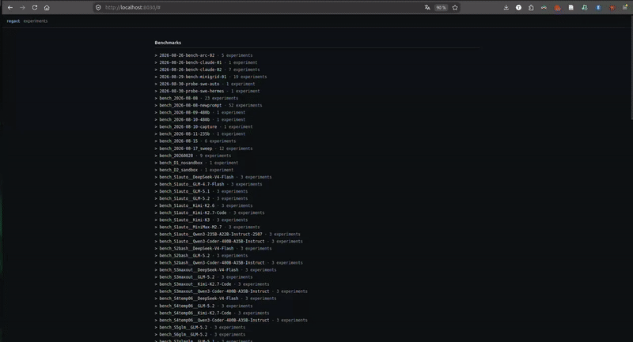

<div align="center">

# regact

**Reasoning · Game · Act**


</div>

---

**regact** is a research framework for agents that **reason** about an unknown
**game** and **act** in it. It drives a *code-writing agent* (Claude Code, codex,
or Alan) that plays an environment (ARC-AGI-3, MiniGrid) through a set of pluggable
**features** — the base one being `controller`, where the agent writes a pure
`act(obs) -> action` policy and submits it.

Everything is agnostic behind three seams — the **agent**, the **environment** (a
"problem"), and the **features** — so you swap parts and rerun. The agent reaches the
environment only over a localhost **HTTP boundary** and never imports the game, so the
score measures understanding, not memorization.

## Demo

<div align="center">



<em>A code-writing agent probes an unknown game, writes an <code>act(obs)</code> controller, and gets scored — browsed in the visualizer (sped up 2x). <a href="assets/videos/regact_pres.mp4">Full-quality clip</a>.</em>

</div>

## Install

Python **3.11 or 3.12** (not 3.13). Create a venv, install the core, then add only the
extras you need.

```bash
python -m venv .venv && . .venv/bin/activate
make install                # core framework + dev/lint/test tooling (pinned)
```

Add a game engine and/or an agent backend:

```bash
make install-arc            # the ARC-AGI-3 engine   (problem=arc_agi)
make install-minigrid       # the MiniGrid envs      (problem=minigrid)
make install-agents         # the Alan code agent    (agent=alan)
```

The two cloud CLI agents are external programs you install and authenticate once —
see **[docs/agents.md](docs/agents.md)** for `claude` and `codex` setup (one command
each). `scripted` (the deterministic test backend) needs nothing.

## Check your machine

Three diagnostics, each reports only on what you installed:

```bash
make doctor        # is the machine ready? (python, agent CLIs, sandbox, game extras)
make probe         # does the OS sandbox actually confine here? (the R1-R6 contract)
make agentcheck    # do the installed agent backends launch — bare and sandboxed?
```

## Run

A run is composed from config groups you pick by name, plus fields you override
on the CLI. The defaults live in [`src/regact/conf/config.yaml`](src/regact/conf/config.yaml):

```yaml
agent:   scripted        # who writes the code   - scripted | claude | codex | alan
problem: arc_agi         # the environment       - arc_agi | minigrid
controller: default      # always-on: the agent writes + submits a policy (knobs: controller.*)
features: none           # OPTIONAL extra capabilities - none | cwm
sandbox: true            # confine the agent + block egress (false = off)
limits:
  max_turns: 350             # agent turns per task
  max_seconds_per_task: null # wall-clock per task
  max_actions_per_env: null  # env.step cap per env instance
```

The always-on controller's eval knobs live under `controller.*` (e.g. `controller.n_episodes`);
each optional feature owns its knobs under `features.<name>.*`. A few examples:

```bash
# fastest end-to-end, no LLM and no game (scripted agent, one game):
make run ARGS="experiment=dev"

# MiniGrid with Claude:
make run ARGS="agent=claude problem=minigrid"

# ARC-AGI-3 with Alan, add the Code World Model feature, 3 eval episodes:
make run ARGS="agent=alan problem=arc_agi features=cwm controller.n_episodes=3"
```

See a config composed without running it: `make run ARGS="... --cfg job"`.

## Documentation

| Guide | What it covers |
|---|---|
| **[Overview](docs/overview.md)** | The three seams and how a run flows through them |
| **[Agents](docs/agents.md)** | Use an agent backend · add a new one |
| **[Environments](docs/environments.md)** | Use a problem · add a new one |
| **[Features](docs/features.md)** | Use a feature · add a new one |
| **[Experiments](docs/experiments.md)** | Launching runs, outputs, and the visualizer |
| **[Sandboxing](docs/sandboxing.md)** | How isolation works and how it is verified |

## Development

```bash
make check         # the CI gate: ruff + mypy + unit tests
make test-all      # every test, including the live ones (needs alancode / a game)
```
