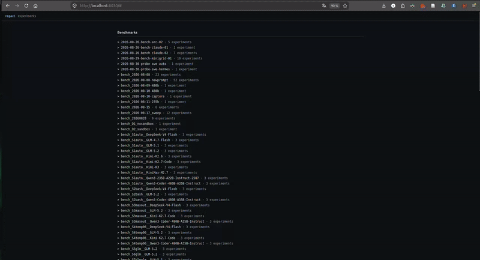
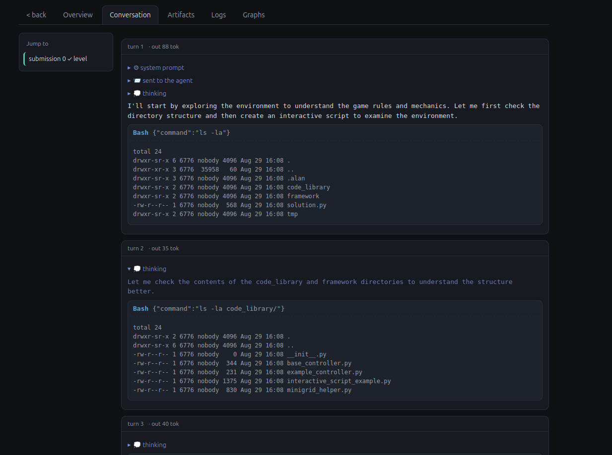
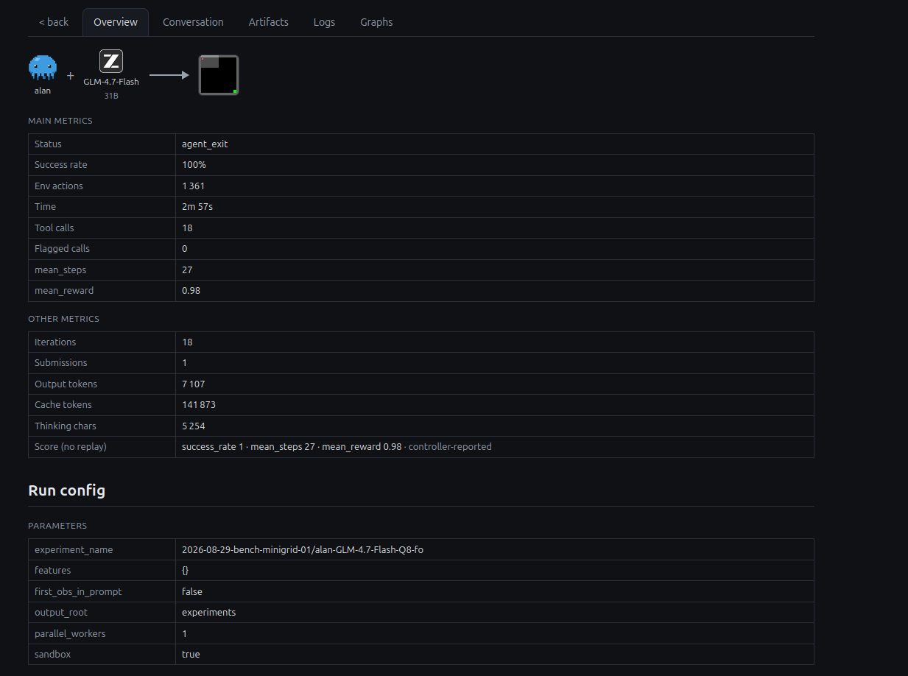
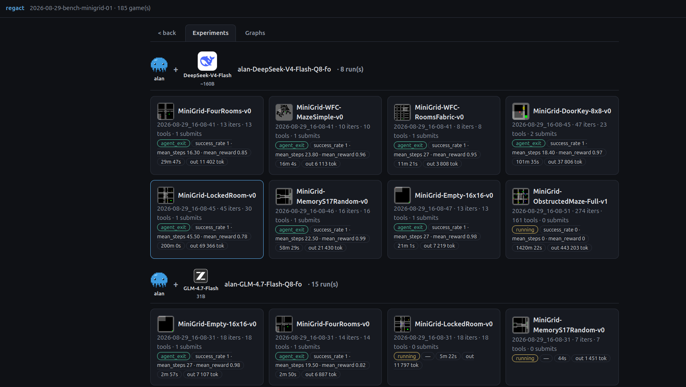
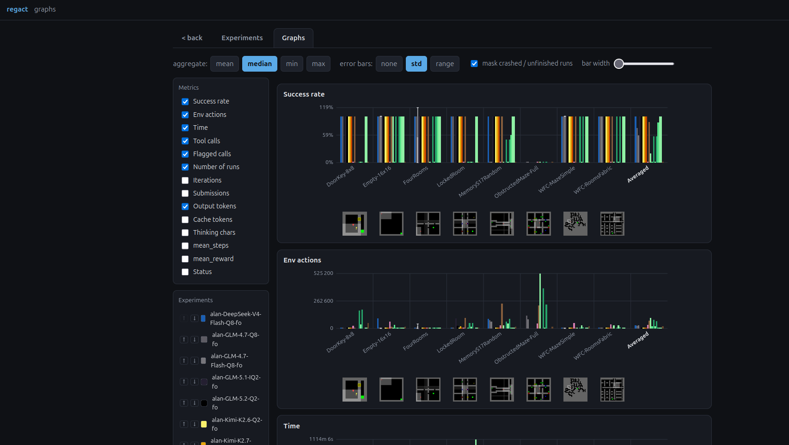

<div align="center">

# regact

**Reasoning · Game · Act**


</div>

---

**regact** is a research framework for agents that **reason** about an unknown **game** and **act** in it. A code-writing agent (Claude Code, Codex or Alan) develops Python controllers for environments such as ARC-AGI-3 and MiniGrid. Select an experiment **protocol** to choose how the agent learns and interacts:

| Protocol | Workflow |
|---|---|
| **`vanilla`** | Read recorded experience, write a controller, and run it in the real environment. |
| **`cwm`** | Build and validate a **Code World Model**, then run State-based controllers with per-action prediction checks. Current design: **v5**. |
| **`policy_search`** (default) | Explore directly, write `solution.py`, and evaluate the policy on fresh episodes. |

Vanilla and CWM share dataset access, execution, resets and logging. Both support continuing one live environment across controller calls (`single_instance`) or starting fresh per call (`multi_instance`). Each call constructs a fresh controller; it may retain private memory within that call.

The **agent**, **problem** and **protocol** have separate extension interfaces. Framework operations cross a localhost HTTP boundary. With sandboxing enabled, the game source is hidden from the agent. Submitted vanilla/CWM code is also isolated from the live environment and experience database. See [Protocols](docs/protocols.md) for the design and [CWM v5](docs/cwm.md) for its requirements and limitations.

## Demo

<div align="center">



<em>The policy-search workflow: a code-writing agent probes an unknown game, writes an <code>act(self, obs)</code> controller, and gets scored — browsed in the visualizer (sped up 2x). <a href="assets/videos/regact_pres.mp4">Full-quality clip</a>.</em>

</div>

## Install

Python **3.11 or 3.12** (not 3.13). Create a venv, install the core, then add only the
extras you need.

```bash
python -m venv .venv && . .venv/bin/activate
make install                # core framework + dev/lint/test tooling (pinned)
```

Add a game engine and/or an agent backend:

```bash
make install-arc            # the ARC-AGI-3 engine   (problem=arc_agi)
make install-minigrid       # the MiniGrid envs      (problem=minigrid)
make install-agents         # the Alan code agent    (agent=alan)
```

The two cloud CLI agents are external programs you install and authenticate once —
see **[docs/agents.md](docs/agents.md)** for `claude` and `codex` setup (one command
each). `scripted` (the deterministic test backend) needs nothing.

## Check your machine

Three diagnostics, each reports only on what you installed:

```bash
make doctor        # is the machine ready? (python, agent CLIs, sandbox, game extras)
make probe         # does the OS sandbox actually confine here? (the R1-R6 contract)
make agentcheck    # do the installed agent backends launch — bare and sandboxed?
```

## Run

A run is composed from config groups you pick by name, plus fields you override
on the CLI. The defaults live in [`src/regact/conf/config.yaml`](src/regact/conf/config.yaml):

```yaml
agent:   scripted        # who writes the code   - scripted | claude | codex | alan
problem: arc_agi         # the environment       - arc_agi | minigrid
protocol: policy_search  # workflow: policy_search | vanilla | cwm
controller: default      # policy_search evaluation settings (controller.*)
features: none           # optional additive capabilities inside policy_search
sandbox: true            # confine the agent + block egress (false = off)
limits:
  max_turns_per_task: 350             # outer send cycles per task; null = unlimited
  max_seconds_per_task: null # wall-clock per task
  max_actions_per_episode: null  # env.step cap per episode; reset renews it
```

Policy-search evaluation settings live under `controller.*`. Vanilla/CWM settings live under `protocol.*`; their features setting must be `none`. Problem configs default to `multi_instance`, so select `single_instance` explicitly for persistent interaction.

```bash
# smoke test: scripted agent, no LLM; runs ARC ls20 (requires make install-arc and game data):
make run ARGS="experiment=dev"

# MiniGrid with Claude, continuing a live environment:
make run ARGS="agent=claude problem=minigrid protocol=vanilla features=none problem.lifecycle=single_instance limits.max_tool_calls=100 limits.max_seconds_per_task=3600"

# ARC-AGI-3 with Codex and CWM v5:
make run ARGS="agent=codex problem=arc_agi 'problem.tasks=[ls20]' protocol=cwm features=none problem.lifecycle=single_instance limits.max_tool_calls=100 limits.max_seconds_per_task=3600"

# Policy search with independent controller evaluations:
make run ARGS="agent=claude problem=minigrid protocol=policy_search controller.n_episodes=3"
```

Inspect configuration without running it by adding `--cfg job --resolve`. Use `dry_run=true` to generate the actual workspace and prompt for inspection in the viewer, without starting the agent or collecting random experience. See [Experiments](docs/experiments.md) and the [parameter tables](docs/managed_protocols.md#shared-protocol-parameters).

## Visualization

Explore saved experiments in the local browser viewer:

```bash
make viz EXP=experiments                   # browse all experiments and benchmarks
# Or open one experiment's latest run:
make viz EXP=experiments/<experiment_name>/latest
```

Open **[localhost:8030](http://localhost:8030)**. Set `PORT=8031` to use another port. You can then navigate to an experiment and browse its tasks. In each of them you have access to panels Overview, Conversation, Artifacts (files and videos) and Graphs (metrics).

For vanilla/CWM, **Load controller playback** in Conversation reconstructs each call's real trajectory from recorded observations. CWM also has a **CWM** panel for phase history, validation, counterexamples, episodes and optional plans. These trajectories are loaded on demand rather than stored as videos. **Jump to** navigates framework commands at tool-call granularity, including multiple calls inside one Codex turn.

| Conversation | Overview |
|---|---|
|  |  |
| Follow the agent's messages and tool calls, and jump between submissions. | Inspect the game preview, scores, resource usage, and run configuration. |

If you performed your experiments in `experiments/<benchmark_name>/`, you can also compare multiple runs of the same benchmark and see their metrics side by side with the Graphs panel of a benchmark interface.

| Benchmark experiments | Benchmark graphs |
|---|---|
|  |  |
| Browse experiments and compare their task results and resource usage. | Compare metrics across experiments, choose an aggregation, and filter crashed runs. |

## Documentation

| Guide | What it covers |
|---|---|
| **[Overview](docs/overview.md)** | Architecture, extension points and code map |
| **[Protocols](docs/protocols.md)** | Choose a workflow · lifecycle versus protocol · add a protocol |
| **[Managed execution](docs/managed_protocols.md)** | Vanilla and shared CWM behavior · controllers, resets, dataset API and parameters |
| **[CWM v5](docs/cwm.md)** | Modeling, validation, exploration, simulation, optional planning and limitations |
| **[Agents](docs/agents.md)** | Use an agent backend · add a new one |
| **[Environments](docs/environments.md)** | Use a problem · add a new one |
| **[Features](docs/features.md)** | Policy-search evaluation settings and optional extensions |
| **[Experiments](docs/experiments.md)** | Launching runs, outputs, and the visualizer |
| **[Sandboxing](docs/sandboxing.md)** | How isolation works and how it is verified |

## Development

```bash
make check         # local checks: ruff + mypy + unit tests
make test-all      # every test, including the live ones (needs alancode / a game)
```
