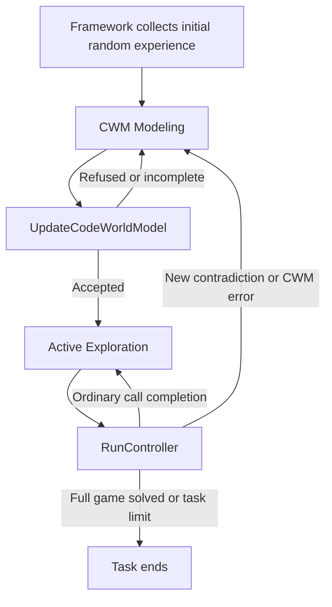

# Code World Model protocol (v6)

The `cwm` protocol asks a coding agent to maintain an explicit, executable explanation of an unknown game. The agent implements a compact State representation and rules that reconstruct observations and predict actions. Regact validates these rules against recorded experience, then checks them during real interaction.

Select `protocol=cwm features=none`. **v6** describes this protocol design; it is not a configuration value. Start with [Managed execution](managed_protocols.md) for the shared vanilla/CWM controller, lifecycle, reset, dataset and budget behavior. This page describes the additional CWM requirements.

## Workflow



There is no agent-facing phase 0. The initial dataset is read through the same API as all later experience. The two phases are **CWM Modeling** and **Active Exploration**.

In single-instance mode, the environment remains where initial collection or the last controller left it, including while the agent repairs its CWM. Every `RunController` still creates a fresh controller object. Multi-instance mode starts each call from a fresh reset instead.

## Agent workspace

The common files include `controller.py`, `framework/commands.py`, `framework/data_api.py`, the action-list controller helper, and configured game helpers. CWM additionally supplies:

```text
docs/
  CWM_modeling_phase.md
  active_exploration_phase.md
world_model/
  __init__.py
  model_state.py
  model_initial_state.py
  model_render.py
  model_transition.py
```

With `protocol.workspace_helpers_enabled=true` (default), the agent also gets `framework/cwm_env.py`. With `protocol.planner.enabled=true` (default false), it gets `goal.py`, `docs/plan_in_CWM.md`, and the `PlanInCWM` command.

The system prompt gives the workflow and actual file inventory. The generated phase documents explain implementation and feedback, while `framework/data_api.py` documents data access through docstrings. `world_model/` is agent-owned. There is no generated `CWM_INTERFACE.md` or direct environment client.

## CWM Modeling

### Implement four definitions

| File | Definition | Purpose |
|---|---|---|
| `world_model/model_state.py` | `State` | A compact representation, usually a dataclass |
| `world_model/model_initial_state.py` | `get_initial_state(obs) -> State` | Build the State from the first observation of an episode |
| `world_model/model_render.py` | `render(state) -> dict` | Reconstruct the complete observation |
| `world_model/model_transition.py` | `step(state, action) -> State` | Predict the State after one problem-format action, carrying hidden state too |

An **episode** begins at an environment start or an explicit reset and runs until the next reset. `get_initial_state` builds the State from the episode's first observation (the game's start, or after a level reset the start of whichever level is current), and `step` carries it from there, through level completions too, including what the screen does not show. This lets a CWM model hidden state, such as a budget counter shown at lower resolution than it counts, which a function of the current observation alone cannot.

The design assumes three things about the game:

1. It is a **deterministic POMDP**: it may have hidden state, but transitions and observations involve no randomness.
2. **The first observation of an episode determines the whole game state**, hidden part included. A level reset may keep a game variable from before the reset only if the reset screen shows it (sc25 does this on levels 4 and 5), so `get_initial_state` reads the screen and cannot assume one fixed start per level.
3. The start is fixed. `get_initial_state` takes the observation as input, so several distinct start observations are also supported.

Under these, an episode's first observation and the actions taken since determine every later observation, which is what validation replays.

Normal package imports work, for example `from world_model.model_state import State`. Callbacks must be repeatable and must not mutate their inputs. `step` predicts the environment; it does not contact it.

States can contain JSON-compatible values, tuples and instances of classes defined in submitted Python modules. Dictionary keys beginning with `@` are reserved by serialization. Serialization includes class and field names, so state byte size differs from source size and Python memory use.

### Validate against all recorded evidence

```bash
python framework/commands.py UpdateCodeWorldModel
```

The command has no arguments. It snapshots the current CWM and static local Python imports, then replays every recorded episode in time order:

```text
state = get_initial_state(o_0)                             render(state) == o_0
for each recorded (a_t, o_t):  state = step(state, a_t)    render(state) == o_t
Repeatability: identical callback inputs must produce identical outputs (episode starts, every 10th step)
```

An episode stops at its first divergence, since the State after it is unreliable; validation reports one counterexample per distinct diverging history: episodes that repeat a history already reported end there without another counterexample. Episodes that share a first observation and an action prefix (multi_instance runs, or the same sequence replayed after a reset) reuse the validated States of the shared prefix; only States at such shared points are kept in memory. The validation record stores the wall time and the agent-code time of each validation. The agent-code budget is the larger of `max_seconds_per_UpdateCodeWorldModel` and `max_seconds_per_UpdateCodeWorldModel_per_1000_steps` per 1,000 recorded steps.

Equality covers the **complete observation**: `frame`, `reward`, `is_done`, `available_actions` and `info`, including nested values, dimensions and list order. JSON dictionary key order does not matter. A correct-looking image can still have incorrect reward or metadata.

The compactness condition is:

```text
sum(serialized State bytes over the validated States)
--------------------------------------------------- < protocol.threshold_max_state_obs_size_ratio
sum(serialized observation bytes they render)
```

The default threshold is **0.5**, strictly. The ratio of the single largest State must also stay below it, so States that grow along an episode fail. On failure, feedback includes the smallest/largest state sizes and their observation IDs. Python source/constants are not counted in this ratio.

### Interpret validation feedback

| `status` | Meaning |
|---|---|
| `Accepted` | Validation finished and all checks passed; enter Active Exploration |
| `Refused` | Validation finished with failed checks; inspect counterexamples and repair |
| `Incomplete` | Validation could not finish, for example due to code/resource errors |

`checked` reports how much evidence was processed, not only successful checks. `cwm_version` identifies the accepted frozen code and `dataset_version` the evidence checked. These are identifiers, not scores; `cwm_version` counts accepted CWMs (1, 2, 3, ...). A refused/incomplete replacement does not replace the previously accepted snapshot.

Failure types include reconstruction mismatches (an episode's first observation), prediction mismatches (the carried State stopped matching; named by episode and step), compression failure, and non-repeatable CWM callbacks. Feedback points to episode/step/observation/transition/diagnostic IDs. `data_api.load_history(episode_id)` gives the recorded order. Structural differences are bounded by `protocol.feedback.max_diff_items`; `differences_omitted` appears only when additional differences exist. Full diagnostic evidence remains readable through the data API.

A `phase_change` field in the command result announces transitions. The agent can run real controllers only during Active Exploration. Editing accepted CWM files or their imported dependencies requires another successful validation before real execution. Editing only a controller or local test script does not, unless the CWM itself imports that file.

## Active Exploration

The agent writes `controller.py`, with a module docstring describing the experiment and `get_controller()` returning an object implementing `act(state)` and `is_done(state)`. `is_done` may always return `False`. An optional `objective_reached(state)` reports a subgoal independently of stopping.

```bash
python framework/commands.py RunController
```

There is **no preliminary simulated episode and no novelty requirement** for real execution. For each action, the framework:

1. Gives the controller the current State: `get_initial_state(starting observation)` in multi_instance, or the State carried across calls in single_instance (after a reset, `get_initial_state` of the reset observation, checked against it). After an acceptance, that carried State is the end of validation's replay of the live episode.
2. Checks whether the fresh controller wants to stop; otherwise calls `act(state)`.
3. Computes the CWM's next State with `step` and its predicted observation with `render`.
4. Executes the real action and records the actual transition.
5. Compares predicted and actual observations; on a match the predicted State becomes the current State and its size is checked.

A prediction computation error prevents that action from being taken. A wrong prediction is detected **after** the real action, so its consequence remains in the live environment and the evidence is retained.

The first CWM contradiction stops the call and returns the agent to CWM Modeling. Ordinary completion leaves it in Active Exploration. Code/resource errors are reported separately from evidence that a game rule is wrong; follow the result's `phase_change` field for whether revalidation is needed. Controller failures receive worst performance metrics while preserving already recorded experience.

New observations can reveal a contradiction, but a familiar predicted observation can also be useful evidence. Neither `actual_novel_observations` nor the controller's `goal_achieved` is an external measure of game success. The problem supplies performance metrics and the full-game completion predicate.

Explicit reset commands work in either phase. The next RunController checks `render(get_initial_state(reset observation))` against the reset observation; a mismatch returns the agent to CWM Modeling. See [reset semantics](managed_protocols.md#explicit-resets).

## Local simulation

The optional `framework/cwm_env.py` exposes `EnvCWM` and `make_cwm_env`. The agent may write other local tests freely.

```python
from framework.cwm_env import make_cwm_env

env = make_cwm_env()  # the State the next real controller starts from
state = env.reset()
# action = ...       # choose a valid game action for this State
# next_state = env.step(action)
```

The factory reads `controller_start_observation_id`: current observation in single-instance mode, original initial observation in multi-instance mode. Alternatively pass an explicit State with `make_cwm_env(initial_state=state)` or `EnvCWM(initial_state=state)`. `obs_mode=True` returns rendered observation dictionaries. Resetting this local environment returns to its supplied initial State; it does not reset the real game.

Local simulation uses **current workspace code**, not necessarily the accepted frozen CWM. It does not validate code, collect real experience, spend real actions or change phase. It runs as an agent script under the shell/backend timeout, rather than the framework's isolated-callback limits. A successful local simulation is useful debugging evidence, not framework acceptance.

## Optional planner

The planner is disabled by default. Enable `protocol.planner.enabled=true` to expose `PlanInCWM`; it is a helper, not a required stage before `RunController`.

1. Write a goal description in `goal.py`'s module docstring.
2. Define `achieved(state) -> bool` and optionally `utility(state) -> float` in `[0, 1]`.
3. Run `python framework/commands.py PlanInCWM` with no arguments.
4. Inspect the returned candidate and, if useful, import its `ACTIONS` into an `ExplorationControllerFromListActions` instance in `controller.py`.
5. Call `RunController` separately to apply it to the real environment.

If utility is absent, it is `float(achieved(state))`. An achieved goal must have utility 1; utility 1 alone does not imply achievement. Callbacks must be repeatable and non-mutating.

The current algorithm is **breadth-first search (BFS)**. It starts from the same lifecycle-dependent observation as the next controller, without taking a real action. It enumerates the problem's available actions, including coordinate actions where defined. It maximizes **endpoint utility**, then minimizes action-list length; it does not sum rewards along the path. Utility ranks candidates but does not guide the BFS expansion order.

The planner still requires a candidate to visit at least one predicted observation outside the dataset. This filter applies to planning, **not** to direct `RunController`. A bounded search can return a useful partial candidate. `goal_achieved` and `optimality_proven` are independent: inspect both warnings. No candidate within the search bounds does not prove the goal impossible in the real game.

Plans are saved under `plans/plan_<index>.py`. They are predictions from a particular accepted CWM and starting observation. Reconsider them after changing the CWM or moving the live environment. The planner never automatically submits its result.

## Additional CWM parameters

For shared collection, execution, data, feedback and task settings, see the [complete shared parameter tables](managed_protocols.md#shared-protocol-parameters). These additional defaults come from [cwm.yaml](../src/regact/conf/protocol/cwm.yaml).

| Full parameter | Default | Meaning |
|---|---|---|
| `protocol.threshold_max_state_obs_size_ratio` | `0.5` | Strict upper bound on aggregate serialized State/observation size ratio |
| `protocol.workspace_helpers_enabled` | `true` | Supply the local environment helper `framework/cwm_env.py` |
| `protocol.execution.max_seconds_per_UpdateCodeWorldModel` | `90` | Time spent in submitted code during one validation: world-model callbacks plus their module imports. Store reads and comparisons are not charged |
| `protocol.execution.max_seconds_per_UpdateCodeWorldModel_per_1000_steps` | `30` | The same budget per 1,000 recorded steps; a validation gets the larger of the two, so long runs are not refused for length |
| `protocol.planner.enabled` | `false` | Expose planner command, goal template and guide |
| `protocol.planner.algorithm` | `bfs` | Only implemented search algorithm |
| `protocol.planner.max_seconds_per_planner_call` | `30` | Whole planner operation, including startup and goal evaluation |
| `protocol.planner.max_cwm_calls_per_planner_call` | `10000` | CWM `get_initial_state`/`step`/`render` calls |
| `protocol.planner.max_nodes_per_planner_call` | `10000` | Stored search states, including start |
| `protocol.planner.max_depth_per_planner_call` | `100` | Maximum action-list length |

All `max_*` options accept `null`. Goal evaluations consume time but not the CWM-call counter. Callback/memory/task limits still apply. With planning enabled, a finite planner depth cannot exceed a finite `protocol.max_actions_per_RunController`.

## Studying a run

In `make viz`, use **Conversation** to follow commands and load the recorded real trajectory next to each `RunController` result. **CWM** provides dataset counts, phase history, validation evidence, counterexamples, episodes and optional plans. See [Experiments](experiments.md#the-visualizer) for the complete viewer guide and storage layout.

Real playback reconstructs frames from recorded observation occurrences, preserving repeated IDs. Predicted plan playback re-executes saved actions in the frozen CWM, not a new search or a real environment. Runtime/source checks can refuse replay when the required implementation no longer matches. No persistent video is required for either path.

Read feedback and metadata alongside pictures: images alone do not show reward mismatches, milestone semantics or hidden state. The agent's workspace can have changed since a submission; use the frozen code and recorded version associated with the operation when analyzing it.

## Scientific and operational limitations

- **Acceptance is in-sample consistency.** Passing all checks does not prove the rules generalize. A CWM can memorize observed cases in Python constants. Isolation prevents runtime database access, but cannot prevent the agent embedding previously read data. The size ratio measures State encoding, not conceptual quality or source complexity.
- **Novelty is not understanding.** A timer or combinatorial visual change can produce many unique observations without learning a new mechanism. Evaluate task progress, hypotheses tested and successful repairs alongside novelty.
- **The three assumptions are checked through one observable consequence.** The same first observation and the same actions must give the same observations. When an episode repeats a recorded history and then sees a different result, the framework stops the task with `observation_determinism_violation`: the game is random, or something hidden survived a reset, and no CWM of this form can model either. The check never raises a false alarm but only fires when a history is repeated. The same observation and action leading to different successors is expected with hidden state and is not a violation.
- **Hidden state must be carried by `step`.** MiniGrid's hidden step counter affects terminal reward and truncation, and ARC games can hide counters too: the State needs a field for them.
- **Search and compute affect the experiment.** BFS can spend its budget enumerating a large action space; default planning is off. CWM overhead differs from vanilla even at identical real-action budgets.
- **Exploration scores are not held-out evaluation.** Neither CWM nor vanilla runs an independent final policy test. Best observed progress is not evidence of robust performance across new seeds.

Shared operational limits include finite snapshots/transport, growing evidence storage, native environment calls that cannot be forcibly interrupted like worker callbacks, and no automatic crash recovery. See [Managed execution](managed_protocols.md#code-isolation-and-practical-limits).

### Deferred work

These are possible future changes, not current options:

- Continuing for a bounded number of actions after a contradiction; exploration stops immediately.
- Planner redesign, reusable local planning functions, richer action selection, and arbitrary planner starting States.
- An ablation that permits exploration without prior validation.
- Crash/resume support, dataset pruning/quotas and further analysis plots.

Persistent single-instance interaction, vanilla, explicit resets, per-call conversation playback and optional local simulation are already implemented. They are not deferred items.
